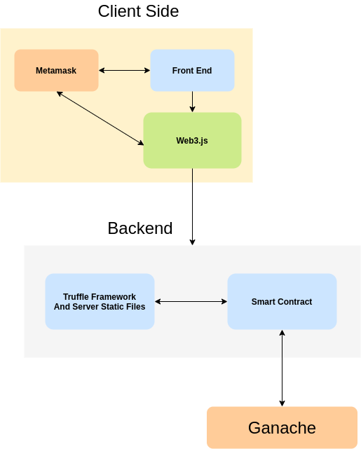

# eth-todo-list
A Todo List Powered By Blockchain

### Introduction
"eth-todo-list" is a simple dummy application powered by blockchain to store and mark\
your day-to-day task. The objective of this application is to demonstrate how you can\
create a decentralized app with a web interface.


### Requirements.
This project requires the following tools:
1. Ganache\
[Install Ganache](https://trufflesuite.com/ganache/)
2. Node JS\
[Install Node](https://nodejs.org/en/)
3. Truffle v5.0.2.\
[Truffle NPM Module](https://www.npmjs.com/package/truffle)\
`npm install -g truffle@5.0.2`
4. Metamask chrome extension.\
[Add Metamask To Chrome](https://chrome.google.com/webstore/detail/metamask/nkbihfbeogaeaoehlefnkodbefgpgknn?hl=en)

### Installation.
1. Clone this repo.
2. `cd eth-todo-list`
3. Install node modules `npm install`
4. Run the dev server `npm run dev`

### Configuration.
1. Make sure ganache is installed and running on your local machine.
2. Configure the **truffle-config.js** file with your local ganache configuration\
like host, port and network_id.
```module.exports = {
 networks: {
    development: {
      host: "127.0.0.1",
      port: 7545,
      network_id: "*", // Match any network id
    },
  },
  solc: {
    optimizer: {
      enabled: true,
      runs: 200,
    },
  },
};
```
2. Select your local blockchain network in metamask.\
**Reference**\
[How to Install and Use Metamask on Google Chrome?](https://www.geeksforgeeks.org/how-to-install-and-use-metamask-on-google-chrome/)\
[Connect Metamask to localhost.](https://asifwaquar.com/connect-metamask-to-localhost/)

### Architecture



